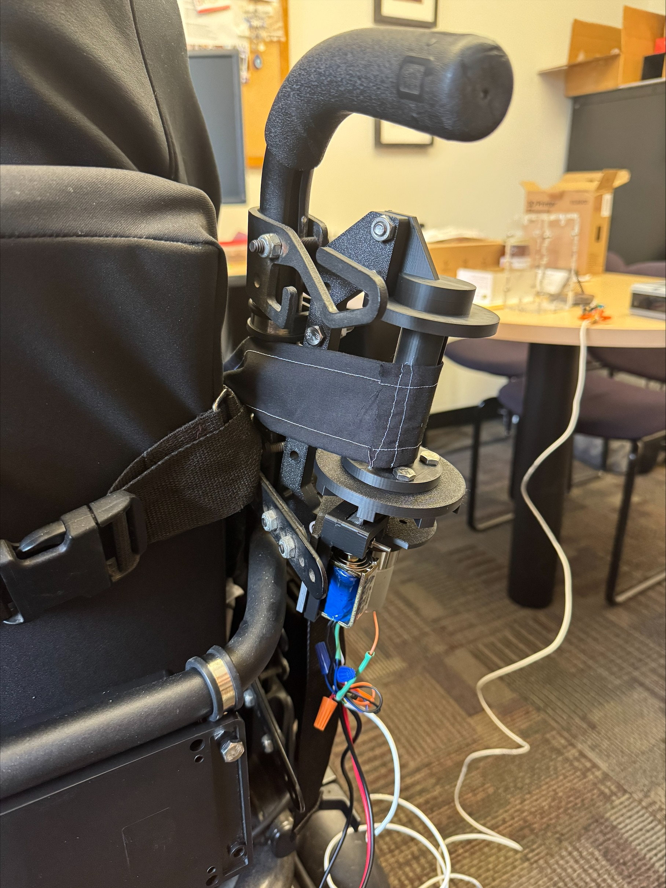
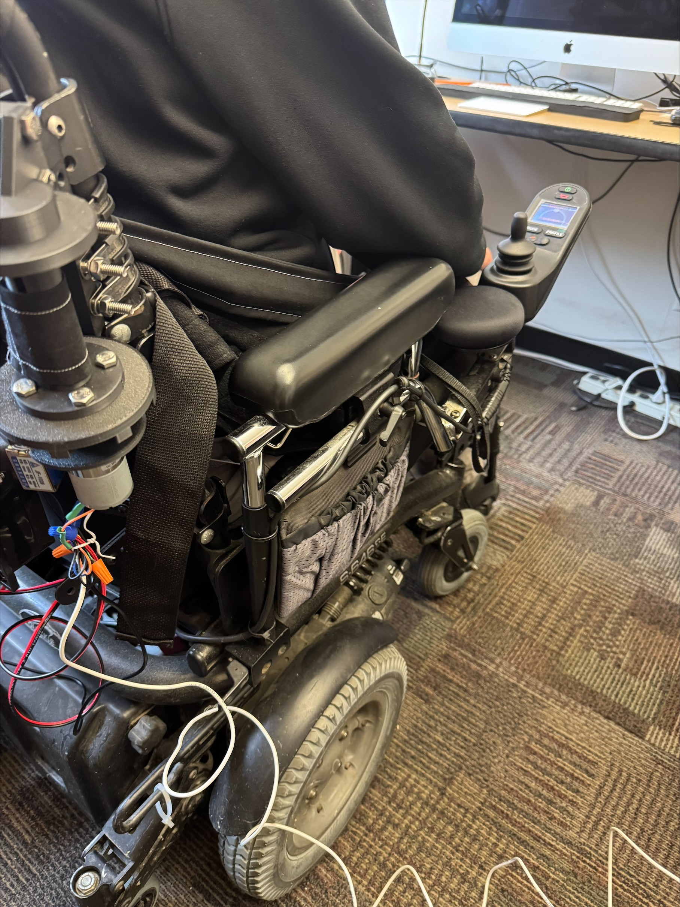
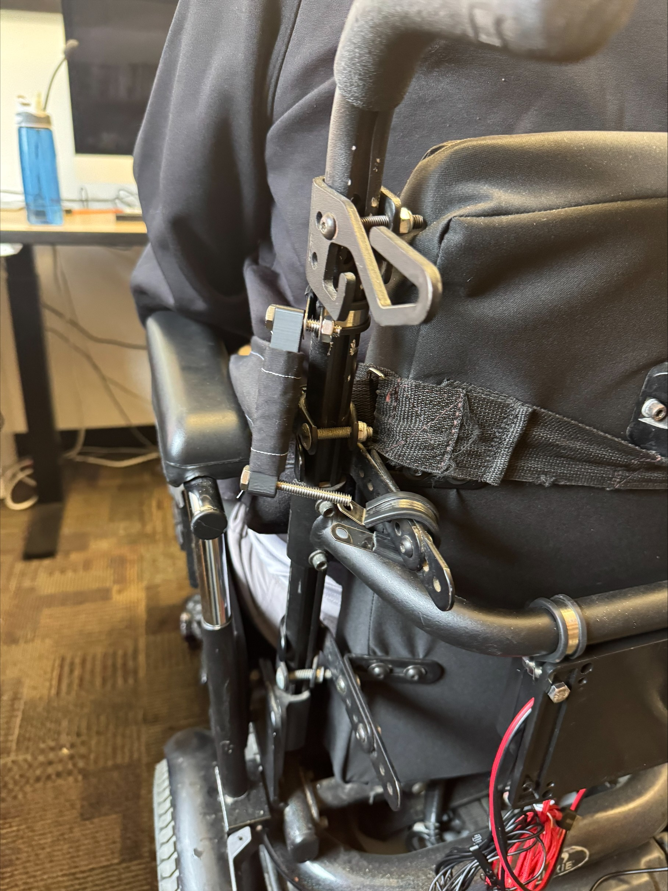
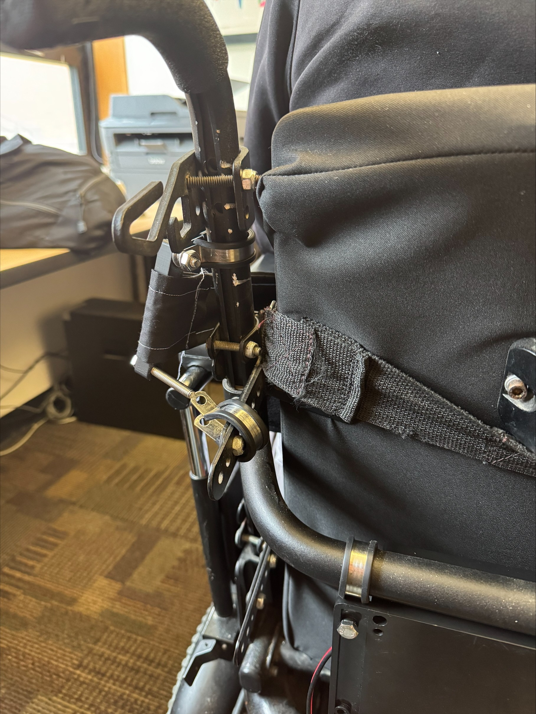
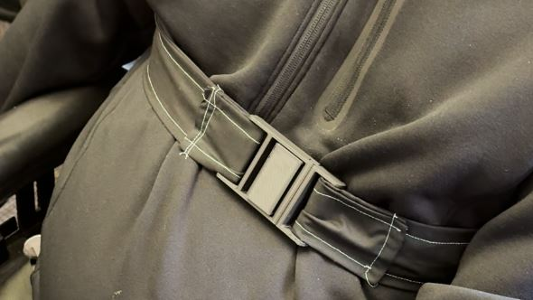

# Upright Assist

Upright Assist is a Raspberry Pi - based assistive control system
designed to improve seated stability for wheelchair users with limited
trunk control. It actuates a motorized strap mechanism to provide
temporary upright postural support and can be triggered either by a physical
3-position switch (center-off, two directions) or by a voice hotword.

------------------------------------------------------------------------

## Build Photos / Assets


Always encase the electronics and the spool/mechanism to protect both
the device and the user. Temporarily took off for debugging in video.

<table>
    <tr>
        <td></td>
        <td></td>
        <td></td>
        <td></td>
        <td></td>
    </tr>
</table>

------------------------------------------------------------------------

## System Description

The Raspberry Pi listens for a voice hotword and reads the state of a
physical 3-position switch. Based on these inputs, it commands a DC
motor through a motor controller HAT to wind or unwind a strap on a
spool.

A pull-type solenoid acts as a simple locking/braking mechanism against
the spool: when engaged, it helps keep the spool from turning to hold
strap position; when activated, it pulls back to allow the strap/spool
to extend outward.

For voice activation, the software typically runs the motor for a fixed
duration in a configured direction and then stops automatically.

------------------------------------------------------------------------

## Features

-   Dual input control (3-position switch + voice)
-   Timed motor actuation for consistent support
-   Cooldown protection to prevent repeated triggers
-   Safe shutdown handling
-   Minimal runtime dependencies
-   Designed for reliability and simplicity

------------------------------------------------------------------------

## Hardware Used

-   Raspberry Pi (tested on Pi 5)
-   Adafruit DC Motor HAT (PCA9685-based)
-   DC motor with appropriate torque for the spool/strap mechanism
-   3-position switch (center-off) for manual extend/retract control
-   USB microphone (for hotword detection)
-   Pull-type solenoid (to lock/release the spool)
-   3D-printed spool (for winding/unwinding the strap)
-   Strap material
-   Wires/connectors as needed for GPIO, power, and motor connections
-   Fasteners and mounting hardware (e.g., screws/clamps/brackets)
-   Power bank for the Raspberry Pi and motor system (≥5V @ 3A Pi rail, ≥5A motor peak)

------------------------------------------------------------------------

## Software Requirements

-   Python 3
-   Raspberry Pi OS
-   Enabled I2C interface

### Python Dependencies

``` bash
pip install -r requirements.txt
```

------------------------------------------------------------------------

## Configuration

All runtime configuration is defined at the top of the script:

-   GPIO pin(s) for switch input
-   Motor selection (motor1--motor4)
-   Motor throttle and direction
-   Actuation duration
-   Voice hotword
-   Cooldown interval

No code changes are required elsewhere.

------------------------------------------------------------------------

## Operation

1.  Power on the Raspberry Pi and motor supply

2.  Run the control script:

    ``` bash
    python main.py
    ```

3.  Activate the system by:

    -   Moving the 3-position switch to drive the motor in either
        direction (center position is off), or
    -   Saying the configured hotword for hands-free activation

For voice activation, the motor engages for a short, predefined interval
and then stops automatically.

------------------------------------------------------------------------

## Safety Notes

-   Always test motor direction and duration without a user present
-   Use a current-limited motor supply
-   Ensure the strap mechanism cannot overtighten
-   The system is intended as an assistive aid, not a medical restraint
-   Supervision is required during use
-   When using a single battery pack, ensure adequate current headroom and separate regulation for logic and motor loads to avoid brownouts.
-   This project is not a certified medical device and is provided for experimental and assistive use only.

------------------------------------------------------------------------

## License

This project is licensed under the MIT License. See [LICENSE.md](LICENSE.md) for details.

------------------------------------------------------------------------

## Acknowledgments

Developed as an assistive solution to improve seated stability and
autonomy for individuals with neuromuscular conditions. I’d like to thank Alejandro Gallo, Jesse Spencer, and Nils Hakansson for their work and help throughout this project.

